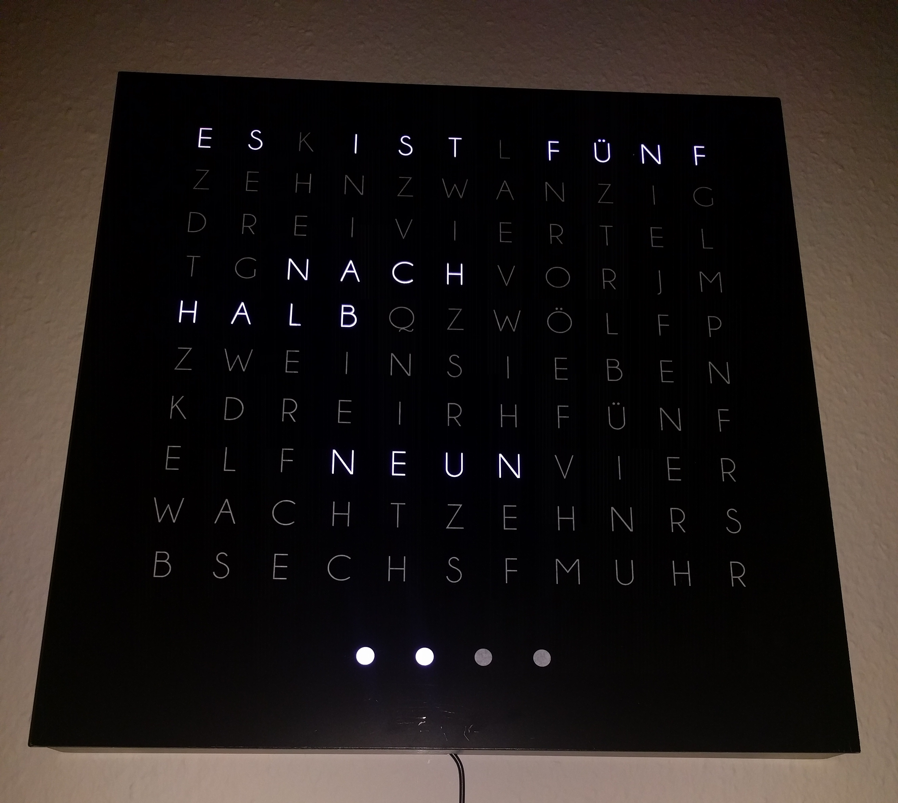

# Wordclock

The Wordclock is a clock which shows the current time in words.
The required software runs on a Raspberry Pi.
It is possible to control the clock with a Xamarin.Forms mobile app.



## Installation Guide

1. Required tools
The Wordclock uses some 3rd party components. Therefore you can use following commands to install the tools:
    
    sudo apt-get install build-essential python-dev python-lxml
    sudo apt-get install python-pip python-scipy scons swig
    sudo apt-get install mono-complete

2. Build required 3rd party components
ToDo: Complete paragraph
```
cd rpi_ws281x
scons
cd python
python psetup.py install
cd ../..
cd soaplib
python setup.py install
```

3. Build Wordclock
Now it is time to build the heart of the Wordclock.
Open the VS-Solution and ensure that the release build flavor is selected.
Rebuild the whole solution.

4. Copy Wordclock
The Wordclock app on the Raspberry is located under /usr/local/wordclock.
This directory needs to be created first:

    sudo mkdir /usr/local/wordclock
    sudo chown pi /usr/local/wordclock
	
Now you are ready to copy the Wordclock on the Raspberry.
Use the file "install/copyWordclock.bat".
	
The Wordclock app starts automatically after a reboot.
This is done with cronjobs.
    
    cd /usr/local/wordclock
    sudo crontab -l > tempCron
    sudo echo "@reboot cd /usr/local/wordclock && /bin/bash /usr/local/wordclock/start.sh &" >> tempCron
    sudo crontab tempCron
    sudo rm tempCron

5. Make start.sh executable
The cronjob will execute the file "start.sh".
Therefore this file must be marked with the executable flag.
    
    cd /usr/local/wordclock
    sudo chmod +x start.sh